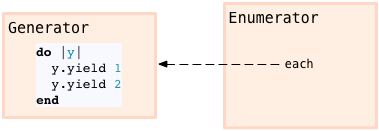
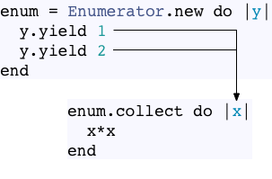

# Ruby 2.0 Works Hard So You Can Be Lazy

> 原文地址: [click] (http://patshaughnessy.net/2013/4/3/ruby-2-0-works-hard-so-you-can-be-lazy)

> Ruby 2.0 的新特征 --- lazy enumerator 看起开很神奇. 它可以让你遍历无穷多的一组值, 然后拿出你想要的. 至少在枚举这方面, 它把函数式编程的惰性求值的概念引入 Ruby 中.

> 比如在1.9 或更早期的 Ruby 版本中, 你将会走进一个无穷的循环来遍历整个无穷的 range:

```ruby
# code01
range = 1..Float::INFINITY
p range.collect { |x| x*x }.first(10)

=> endless loop!
```
> code01 中 调用 collect 开始了一个无尽的循环, 后面的 first 方法永远不会被执行. 但是如果升级到了 Ruby 2.0 使用 Enumerator#lazy 方法, 你就可以避免这种无穷循环的情况, 得到你需要的值:

```ruby
# code02
range = 1..Float::INFINITY
p range.lazy.collect { |x| x*x }.first(10)

=> [1, 4, 9, 16, 25, 36, 49, 64, 81, 100]
```


> 那么 整个惰性求值是如何工作的呢? Ruby 又如何知道我只需要10个值, 在 code02 中我仅仅调用了一个 lazy, 就完成了我的目的.

> 好像魔法一样, 但其实你调用 lazy 的时候 Ruby 内部做了相当复杂的工作. 为了给你你所需要的值, Ruby 自动创建了使用了许多不同类型的 Ruby 内部对象. 如同生产车间的重装备, 这些对象在一起协作用正确的方法处理从无限range 中输入进来的值. 这些对象是什么, 它们做了什么, 又是如何配合的? 我们来探究一下.

#### The Enumerable module: 许多不同调用 each 的方法

> 当我在调用 collect 的时候, 正在使用 Enumerable module. 你可能知道, 这个 module 包含一系列的方法, 如: select, detect, any? 等许多方法, 这些方法以不同的方式处理值. 
> 在内部, 所有的这些方法都是在目标对象或者接收者上调用 each 来工作的:

![Alt] (./collect1.png)

> 你可以把 Enumerable 方法当做一系列不同类型的机器来一不同的方式操作数据, 所有都通过 each 方法.

![alt] (./select-any.png)

#### Enumerable 是急切的(这里翻译的不好,想不出更好的词了)

> 许多 Enumerable 的方法, 包括 collect, 返回数组. 由于 Array 也包含( Mixin ) 了 Enumerable module 并且响应 each 方法, 你可以把不同的 Enumerable 的方法链到一起:

![alt] (./collect-first.png)

> 在我上面的代码中, Enumerable#first 方法在 collect 方法的产生的结果上调用了 each, 数组又是在 range 上调用了 each 生成的.

> 一个重要的细节需要注意: Enumerable#collect 和 first 都是急切的, 就是说它们会在新的数组返回前处理 each 返回的所有的值. 在我例子中, 第一个 collect 处理 range 返回的所有的值并保存到 第一个Array 中.
> 再看 step 2 部分, first处理 第一个数组(图中间的 Array) 所有的值,放入到第二个数组(图右):

![alt] (./two-steps.png)

> 这就是真正导致无穷 range 的没有结尾的循环原因.  因为 Range#each 一直会返回数值, 那么 Enumerable#collect 就不能完成, Enumerable#first 就不会有机会被执行.

![alt] (./endless-loop.png)

#### The Enumerator object: 推迟列举

> 有一个有趣的技巧: 调用 Enumerable module 的方法不提供 block, 例如, 假设我 在 range 上调用 collect 方法,但不提供 block:
```ruby
# code03
range = 1..10
enum = range.collect
p enum
=> #<Enumerator: 1..10:collect>
```

> Ruby 准备了一个对象 可以供你后来使用, 它可以列举整个 range, 叫做 "Enumerater". code03 从打印的内窥字符串中可以看出, Ruby 保存一个引用, 这个引用中内容是接收者(1..10) 和 enumerable 方法的名字, 本例中就是 collect, 被保存到了 enumerator 对象中.

![alt] (./enumerator-collect.png)

> 以后我想要迭代 range 并且把里面的值放到数组中, 只需要在这个 enumerator 上调用 each:
```ruby
# code04
p enum.each { |x| x * x }
=> [1, 4, 9, 16, 25, 36, 49, 64, 81, 100]
```

>>>> 还有一些别的方法使用 enumerators, 比如反复使用 next, 今天就不讨论了.

#### Enumerator::Generator - 为枚举生成新的值

> 在前面的例子我用 Range 对象生成了一组值. 然而, Enumerator 类使用 block 提供了更加灵活的方式来生成值.看下面的例子:
```ruby
# code05
enum = Enumerator.new  do |y|
  y.yield 1
  y.yield 2
end
```

> inspect 看看这到底是什么样的 enumerator:
```ruby4
# code06
p enum

=> #<Enumerator: #<Enumerator::Generator:0x007faf6ab4ca50>:each>
```

>不难看出, Ruby 创建了一个新的 enumerator 对象, 它包含一个内部对象(Enumerator::Generator) 的引用, 而且在该对象上设置了each 方法的调用. 从内部看, generator 对象将我提供的 block 转换为一个 proc 对象然后保存起来:



> 当我使用 Enumerator 对象时, Ruby 将会调用这个 generator 内部的 proc, 为 enumeration 获取值:

```ruby
# code07
p enum.collect { |x| x*x }

=> [1, 4]
```

> 换句话说, 对于迭代来说, Enumerator::Generator 对象才是数据的源头, 它产生值并且将这些值传递.


#### Enumerator::Yielder - 允许一个 block去 yield 另外一个

> 仔细观察上面的代码, 有些奇怪, 我起初用 block 创建了 Enumerator 对象:

```ruby
enum = Enumerator.new do |y|
  y.yield 1
  y.yield 2
end
```

>  yield 产生的值给了我调用 each(collect) 提供的 block:

```ruby
p enum.collect { |x| x*x }

=> [1, 4]
```

> 换言之, enumerator 以某种方式允许你从一个 block 向另外一个传递值:



> 当然 Ruby 并不是这么做的. block 之间是不能像这样互相传值的. 其实的技巧好是 使用了一个内部对象- Enumerator::Yielder, 使用 y 参数传入 block 中:

```ruby
enum = Enumerator.new do |y|
  y.yield 1
  y.yield 2
end
```

> 这里 y 参数很容易漏掉, 但是如果你再次读一下上面的 block 代码, 事实上, 我没有我没有使用 yield 产生并且传递值, 我只是在 y 对象上调用了 yield 方法, y 对象是 Ruby 内建类 Enumerator::Yielder 的实例. 看下面的实验:(irb)

```ruby
$irb
y = Enumerator::Yielder.new { |str| puts str  }
 => #<Enumerator::Yielder:0x007fbf0a282550>

y.yield "test"
test
=> nil
```

>> ** 这里我(译者)补充一下, 我觉得在 Enumerator.new 中把 inpsect 一下 y 会更能说明问题 **

```ruby
$irb
enum = Enumerator.new do |y| 
  p y
end
=> #<Enumerator: #<Enumerator::Generator:0x007fbf0a2de580>:each>

enum.each {}
=> #<Enumerator::Yielder:0x007fbf0a1ab8e8>
```

> 也就是说, y 对象就是 Enumerator::Yielder 的实例, block 中只不过是个简单的方法调用而已,不涉及传值与否的问题

> yielder 拿到我想要 enumerator 产生的值, 通过 yield 方法, 将这些值传递给目标 block. 作为 Ruby 开发者, 除了 yield 方法我一般不会去与 yielder 和 generator 进行交互, 在内部它们被 enumerator 使用. 在 enumerator 调用 each 时, 它会使用这两个对象生成 和传递值:

![alt] (./enumerator-yields.png)


#### Enumerators 产生数据, Enumerable 方法使用数据

> 回顾一下, 目前我在 Ruby 看到的 enumeration 大体上模式是这样的:

*** Enumerator 对象产生数据
*** Enumerable 使用数据(消耗数据)

![alt] (./each-and-yield.png)

> 从右至左, enumerable 方法调用来请求数据; 从左至右, enumerator 对象通过 把数据 yield 给 block 来提供数据.
